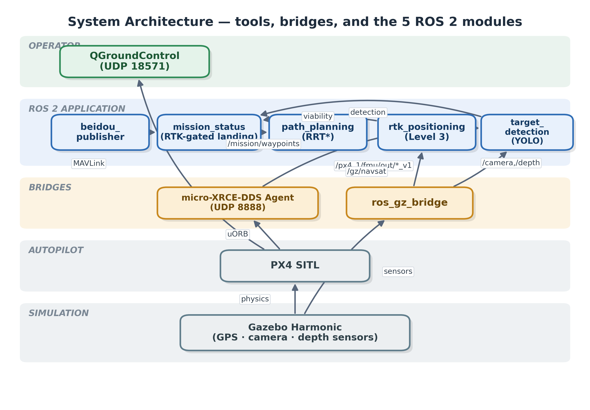
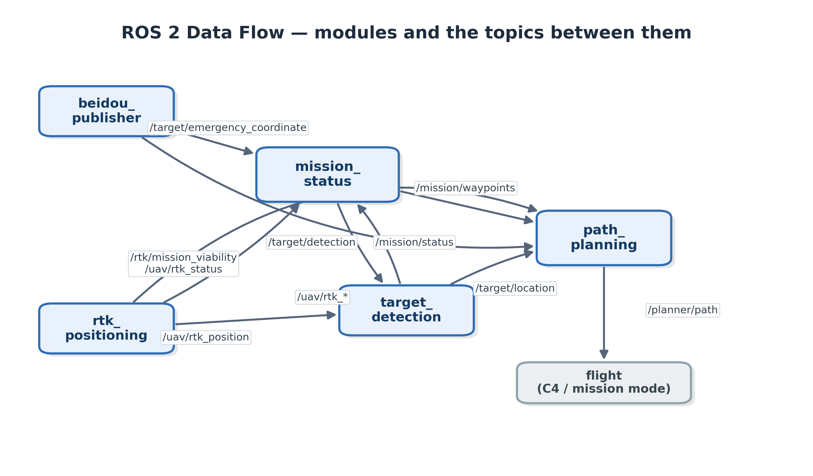
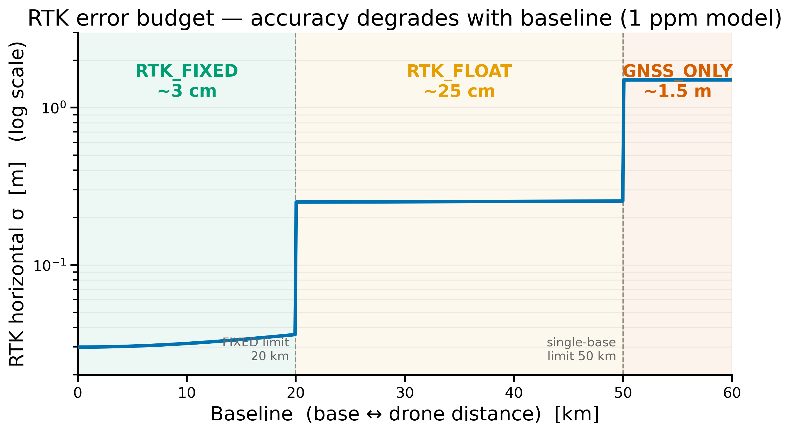
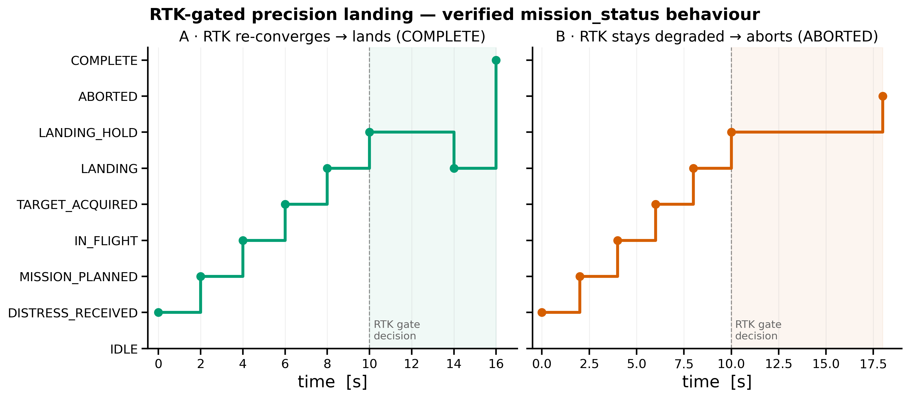
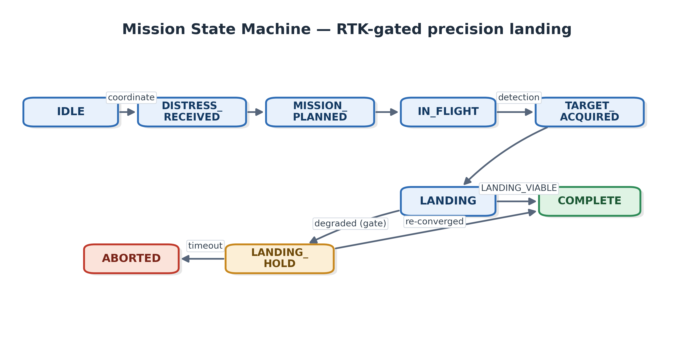

# System Integration Progress Report — UAV Emergency Rescue (BDS)

**Project:** UAV Emergency Rescue System based on BeiDou Navigation
**Author:** Tevin Wills (Student 1), system integration
**Date:** 2026-06-10
**Scope:** integrating the five modules into one ROS 2 system, verifying the control and RTK
tiers on a real PX4/Gazebo backbone, and getting the perception tier ready to run.

---

## 1. Summary

The five modules built by the team (BeiDou short-message, S5; QGC/mission control, S2; target
detection, S3; path planning, S4; RTK positioning, S1) now run together as one ROS 2 (Jazzy)
system, started from a single command.

The rescue pipeline runs end to end as a live topic graph: a BeiDou distress coordinate starts a
mission, which plans an obstacle-avoiding path, flies it in PX4/Gazebo, and lands using RTK
position and target detection. The workspace builds cleanly, 8 of 8 packages.

We verified the control and RTK tiers on the real PX4 SITL + Gazebo + micro-XRCE-DDS backbone.
RTK produced a fixed solution at about 3 cm, and the mission used that live RTK viability signal
to decide when to land. The perception tier (camera plus YOLO) is wired and builds; it runs on a
machine with a real GPU, because the camera and depth sensors need hardware OpenGL to render at a
usable frame rate.

This is an integration result, and we are clear about what that means. The modules publish and
consume each other's topics, and the mission reacts to live RTK quality. The drone currently
flies in PX4 mission mode; closed-loop offboard control and the live camera tier are the next
steps (Sections 7 and 8).

---

## 2. System architecture

The system has five layers: simulation, autopilot, bridges, the ROS 2 application, and the
operator. Figure D1 shows how they connect.

*Figure D1. Gazebo Harmonic supplies physics and the GPS, camera, and depth sensors. PX4 SITL is
the autopilot. Two bridges cross into ROS 2: `ros_gz_bridge` for the Gazebo sensors and the
micro-XRCE-DDS Agent for PX4 state and commands. QGroundControl connects to PX4 over MAVLink
(UDP 18571).*

Inside the ROS 2 application the modules talk over a fixed topic contract (Figure D2). BeiDou
emits the distress coordinate, `mission_status` runs the mission state machine, `path_planning`
produces the route, `rtk_positioning` supplies position, fix quality, and a mission-viability
signal, and `target_detection` reports the survivor.

*Figure D2. The five modules and the topics between them.*

The full toolchain, ports, and per-topic contract are in `docs/PIPELINE_ARCHITECTURE.md` and
`interfaces/integration_contract.md`.

---

## 3. Integration approach and key decisions

We started from a real-anchors-plus-thin-stubs plan, then hardened the stubs into real modules.
Along the way the contract had to be reconciled with what the code actually did. The decisions,
recorded in the contract's Reconciliation Log, were:

| # | Decision | Reason |
|---|---|---|
| A | `/uav/rtk_position` is `sensor_msgs/NavSatFix` (the contract said `PoseStamped`) | RTK and target detection already used NavSatFix; the contract was out of date. |
| B | Added `interfaces/EmergencyCoordinate.msg` for the distress coordinate | The old "Custom" type was never defined. The new one carries lat/lon, source id, and the raw message. |
| C | PX4 bridge is uXRCE-DDS / `px4_msgs`, not MAVROS | The installed and built stack is uXRCE; target detection already reads `/fmu/*`; MAVROS was used by one node only. |
| D | One shared datum (Zurich, the PX4/Gazebo home), passed as a parameter | Fixes a Hangzhou-vs-Zurich mismatch without disturbing the validated Level 3 work. |

One salvage is worth noting. The contributed obstacle-avoidance package was ROS 1, MAVROS, and
Gazebo Classic, so it could not build here. We lifted its RRT\* algorithm into a clean ROS 2 node
(`rrt_star_planner.py`) and dropped the rest. The algorithm is reused; the incompatible plumbing
is gone.

---

## 4. What was built, per module

- `beidou_short_message`: the existing `$CCTXM` decoder now runs inside an rclpy node
  (`beidou_publisher_node`) that publishes the rescue coordinate on
  `/target/emergency_coordinate`, derived from the shared datum plus an offset.
- `qgc_control`: `mission_status_node` runs the mission state machine and gates the precision
  landing on RTK viability (Section 6). It also publishes `/mission/waypoints` and
  `/uav/telemetry`. Yvonne's MAVROS control node is kept but deferred (decision C).
- `path_planning`: the salvaged RRT\* planner routes from the RTK position to the rescue or
  target coordinate and publishes `/planner/path` and `/map/obstacles`.
- `rtk_positioning`: Level 3 resilient RTK, with the error-budget model described in Section 5.
- `target_detection_tracking`: YOLOv8 survivor detection, wired into the integrated launch with
  the camera and depth bridges (Section 7).
- `bringup`: `full_rescue.launch.py` starts all five modules from one command;
  `scripts/launch_sim_24.sh` brings up the backbone.

---

## 5. RTK positioning model

RTK is the positioning backbone. It gives centimetre-level position in good conditions and
degrades as signals weaken in a disaster zone. We model RTK accuracy with the standard RTK error
budget rather than an arbitrary noise level, so each term maps to something a real receiver or
RTKLIB reports:

> σ_RTK = sqrt( floor_status² + (baseline_km · ppm)² + (age · drift)² )

`floor_status` is the per-fix-type floor (about 3 cm fixed, 25 cm float, 1.5 m GNSS-only).
`baseline · ppm` is the usual 1 ppm growth with base-to-drone distance. `age · drift` is the
decay when corrections go stale. The fix state also drops with baseline: it cannot hold a fixed
solution past the configured limit (about 20 km) and falls back to GNSS-only past about 50 km,
which is where single-baseline RTK stops being usable in practice (Figure P1).

*Figure P1. RTK horizontal sigma against baseline (1 ppm model): centimetre-level when the drone
is near the base, dropping to float and then GNSS-only as the baseline grows.*

Every parameter here (the floor, the ppm, the baseline limits, the age drift) can be calibrated
against RTKLIB, using error-against-baseline and percent-fixed-against-baseline from real BeiDou
RINEX, or against a real receiver. That plan is in `PHASE3_RTKLIB_PLAN.md`. The model is a
statistical model of RTK behaviour, not a real RTCM or carrier-phase engine, and Section 7 says
so plainly.

---

## 6. Verification and results

The full workspace builds, 8 of 8 packages.

**On the real backbone (PX4/Gazebo, WSL).** PX4 SITL, Gazebo Harmonic (headless), and the
micro-XRCE-DDS Agent all came up, and the RTK chain produced live data: `/uav/rtk_position` at
10 Hz, anchored at the datum so it matched the drone's `/gz/navsat`; `/uav/rtk_status` reading
`RTK_FIXED` at about 3.3 cm; and `/rtk/mission_viability` reading `LANDING_VIABLE`. With viability
good, the mission cleared the landing and completed. So the "land when viable" path is confirmed
against the real backbone.

**The other two gate behaviours** (hold-and-recover, abort-on-timeout) we tested with a small
viability publisher that drives the sequence directly. This is a unit test of `mission_status`
and does not need the backbone. Figure P2 shows both runs.

*Figure P2. Scenario A: RTK re-converges, so the drone descends and reaches COMPLETE.
Scenario B: RTK stays degraded past the timeout, so the landing aborts. The dashed line is the
viability-gated decision point.*

The state machine that governs this is in Figure D3. Between the backbone run and the unit test
we have covered the three outcomes: land when viable, hold then land on recovery, and abort on
timeout. The hold-and-abort logic is what the Level 3 report listed as the open landing gap.

*Figure D3. The mission state machine. Precision landing proceeds only on `LANDING_VIABLE`,
otherwise it holds for re-convergence and aborts on timeout.*

---

## 7. Honest limitations

1. The system runs in two tiers. The control and RTK tiers run headless and are verified. The
   perception tier (camera, depth, YOLO) needs a GPU machine, because WSL's software renderer
   cannot render the sensors fast enough.
2. The drone flies in PX4 mission mode, not closed-loop offboard control. The RRT\* path is
   published for guidance and visualisation. Offboard control is scheduled (Section 8).
3. RTK here is a statistical model, not a real RTCM or carrier-phase engine. The accuracy figures
   are datasheet-grade assumptions until they are calibrated against RTKLIB.
4. The base station is co-located with the drone home by default (zero baseline). The realistic
   offset-base error model is implemented but left off by default so the Level 3 results stay
   reproducible.

---

## 8. Next steps

1. Run all five modules on the GPU PC, following `docs/NATIVE_PC_RUNBOOK.md` (`gz_x500_depth`,
   confirm the camera topic names, install `ultralytics` and `torch`), and capture the data to
   `results/`.
2. Stand up the operations view in Foxglove, then the custom web dashboard. The build and run
   steps are in `docs/STAGE2_3_DASHBOARD_PLAN.md`.
3. Add closed-loop flight: a uXRCE offboard node feeding `/fmu/in/trajectory_setpoint`.
4. Calibrate the RTK error-budget parameters against RTKLIB (`PHASE3_RTKLIB_PLAN.md`).
5. Swap the synthetic obstacle grid for a live depth costmap (GitHub issue #1).

---

## 9. Figure and diagram index

| Fig | File | Purpose |
|---|---|---|
| D1 | `figures/d1_architecture.png` / `.svg` | System architecture (tools, bridges, modules) |
| D2 | `figures/d2_dataflow.png` / `.svg` | ROS 2 data flow (modules and topics) |
| D3 | `figures/d3_mission_fsm.png` / `.svg` | Mission state machine (RTK-gated landing) |
| P1 | `figures/p1_rtk_error_budget.png` | RTK error budget against baseline |
| P2 | `figures/p2_landing_gate_timeline.png` | RTK-gated landing, the two tested scenarios |

The figures are regenerated by `generate_integration_figures.py` (plots) and `diagrams_mpl.py`
(diagrams). The diagrams are also saved as SVG for the presentation slides.
